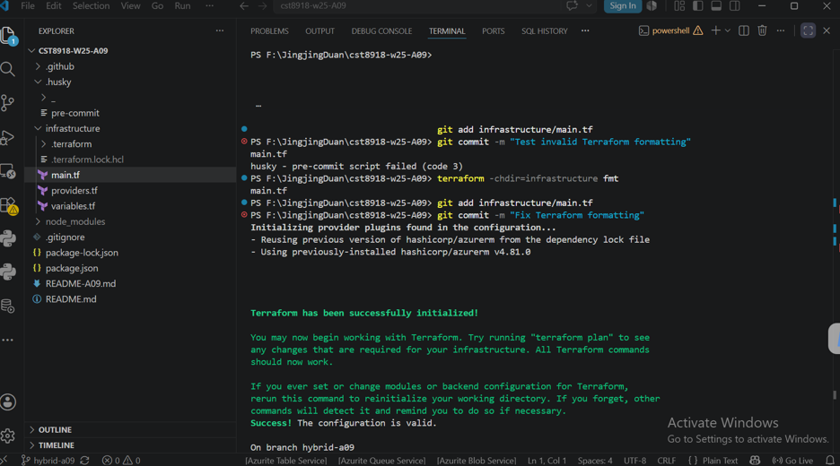
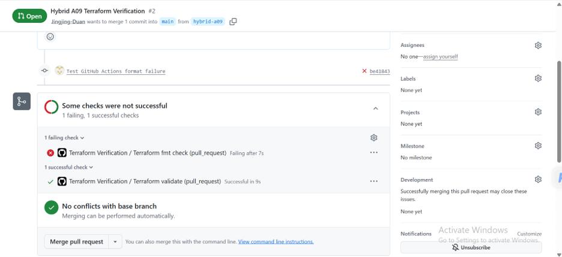
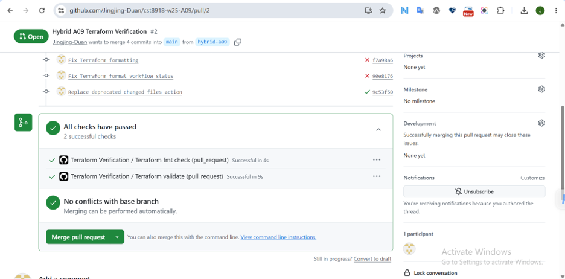

# CST8918 - Hybrid A09: Husky and GitHub Actions

## Objective

This lab demonstrates how to use Husky and GitHub Actions to improve the quality of Terraform Infrastructure as Code (IaC).

## Technologies

- Terraform
- AzureRM Provider
- Husky
- GitHub Actions
- TFLint

## Project Structure

```
.github/workflows/
.husky/
infrastructure/
```

## Features

- Terraform Resource Group configuration
- Husky pre-commit hook
  - terraform fmt
  - terraform validate
  - tflint
- GitHub Actions workflow
  - Terraform formatting verification
  - Terraform validation

## Testing

1. Introduced Terraform formatting errors.
2. Verified Husky blocked invalid commits.
3. Bypassed Husky using `--no-verify`.
4. Created a Pull Request.
5. GitHub Actions failed as expected.
6. Fixed formatting.
7. GitHub Actions passed successfully.

## Demo

### Husky Pre-commit Validation

Husky prevented committing improperly formatted Terraform code.



### GitHub Actions Failed

The workflow correctly detected the Terraform formatting issue.



### GitHub Actions Passed

After fixing the formatting issue, both workflow jobs completed successfully.

